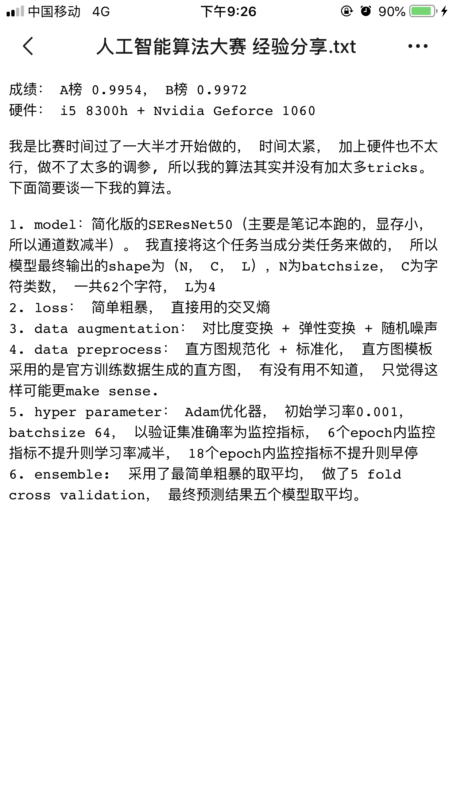

# CAPTCHA_full 验证码识别完整项目

## 如何让项目跑起来
1. 配置环境，运行安装必要的包
2. config.py 下配置好正确的参数
3. 运行 train.py 训练模型
4. （微调模型）
5. （多模型融合）
6. 预测

## 1. 环境和相关的包
```shell
conda install -y tensorflow-gpu=1.12.0
conda install -y keras-gpu=2.2.4
conda install -y opencv=3.3.1
conda install -y imgaug=0.4.0
conda install -y pydot=1.4.1
```

## 2. 在config.json中配置数据集路径

（已将`config.py`作为配置文件）

`config.json` 中的属性 示例及解释
```json
{
  "model": {
    "model": "tensorflow",
    "model_data": "./model_data",             // train后保存的目录
    "model_path": "./model_data/cnn_best.h5", // 预测时读取的模型文件
    "input_size": [         // 神经网络输入大小
      128,
      128
    ]
  },
  
  "train": {      // 训练配置
    "train_data_folder": "F:/data_set/captcha/A/train",     // 存放图片的文件夹：通过与图片名拼接，形成完整路径
    "train_data_file": "F:/data_set/captcha/A/train/train_label.csv",   // 一个csv文件：存放<图片名， 正确标签>
    "train_prob": [     // 将 train_data_file 文件的 0% ~ 80%的部分作为训练集
      0,
      0.8
    ],
    "pretrained_weights": "./model_data/pre_weight.h5",   // 加载这个模型文件进行训练
    "batch_size": 16, 
    "learning_rate": 1e-3,      // 学习率
    "nb_epochs": 1,
    "warmup_epochs": 3,
    "saved_weights_name": "CNN_captcha_weight.h5",        // 训练后以该文件名保存
    "debug": true
  },
  
  "valid": {    // 验证配置
    "valid_data_folder": "F:/data_set/captcha/A/train",   // 存放图片的文件夹：通过与图片名拼接，形成完整路径
    "valid_data_file": "F:/data_set/captcha/A/train/train_label.csv",   // 一个csv文件：存放<图片名， 正确标签>
    "valid_prob": [   // 将 valid_data_file 文件的 80% ~ 100%的部分作为训练集
      0.8,
      1
    ],
    "valid_times": 1
  },
  
  "predict": {
    "predict_data_folder": "./data/test",         // 要预测的图片文件夹
    "predict_data_file": "./data/submission.csv"  // 预测结果输出到submission.csv文件中
  }
}
```

## 3. train.py 训练模型
### 参数

-m 使用的模型名字 如VGG、ResNet50、SEResNet50

-p 加载的模型权重文件

### 运行效果

1. `model_data/{model_name}/train_log.csv`会实时记录训练数据

2. 模型会保存在`model_data/{model_name}/checkpoint/`文件夹下

3. 还有其他的训练结果会保存下来

## 4. 运行fineTuning 微调模型
### 参数

-m 使用的模型名字 如SEResNet50

-p 加载的模型权重文件


# 参考思路
